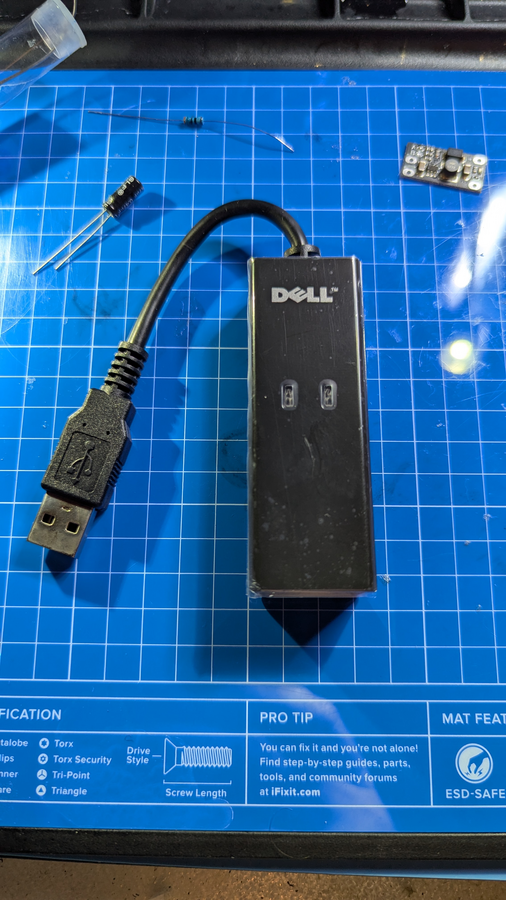

# Overview

How to connect the Sega saturn to the internet

# BOM 

| BOM level | Part number | Part name          | Part description   | Quantity | 
|:----------|:------------|:-------------------|:-----------  ------|:---------|
| 1         | 1           | Conexant RD02-D400 | Conexant RD02-D400 | 1 |
| 1         | 2           | 0.47uf 50V Capacitor | 0.47uf 50V electrolytic capacitor | 1 |
| 1         | 3`          | 330 – 380 Ohm +/-1% resistor   | 330 – 380 Ohm +/-1% resistor | 1 |
| 1         | 4           | DC-DC 6W 5V to 9V  | DC-DC 6W Step-up converter 2.5-5V to 5V 8V 12V | 1 |

Conexant RD02-D400

# Links

https://www.segasaturnshiro.com/guide-build-a-line-voltage-inducer/
https://www.segasaturnshiro.com/saturn-community-projects/online-play/
https://www.dreamcast-talk.com/forum/viewtopic.php?t=12731