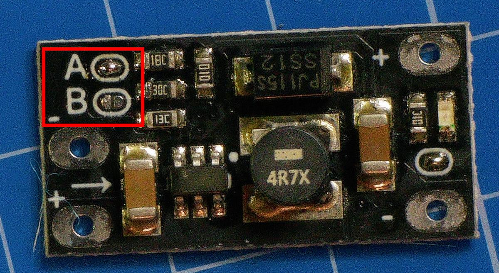

# SEGA SATURN Modem PART 1

## Overview

This guide explains how to connect the Sega Saturn to the internet using a Conexant RD02-D400 RJ11 to USB adapter.  
To do so, the Conexant modem must be modified by adding a low-cost step-up converter that uses the USB 5V and injects 9V into the phone line.

## Modify RJ11 to USB Adapter

### Goal

> 3 to 9 volt range when a telephone on the line goes off-hook. An off-hook telephone typically draws about 20 milliamps of DC current to operate, at a DC resistance around 180 ohms. The remaining voltage drop occurs over the copper wire path and over the telephone company circuits where there is usually 200 to 400 ohms of series resistance to protect from short circuits and decouple the audio circuits.

**Source**: [jkaudio.com](https://www.jkaudio.com/article_03.htm)

### Bill of Materials (BOM)

| BOM Level | Part Number | Part Name                         | Part Description                      | Quantity |
|:----------|:------------|:----------------------------------|:--------------------------------------|:--------:|
| 1         | 1           | Conexant RD02-D400                | Conexant RD02-D400 Modem              |    1     |
| 1         | 2           | 0.47µF 50V Capacitor              | 0.47µF 50V Electrolytic Capacitor     |    1     |
| 1         | 3           | 330–380 Ohm ±1% Resistor          | 330–380 Ohm ±1% Tolerance Resistor    |    1     |
| 1         | 4           | DC-DC 6W 5V to 9V Converter       | Step-up Converter 2.5–5V to 5V/8V/12V |    1     |
| 1         | 5           | JST 2-pin Wire Connector (Male)   | Male JST 2-pin Wire Connector         |    2     |
| 1         | 6           | JST 2-pin Wire Connector (Female) | Female JST 2-pin Wire Connector       |    2     |

<i>BOM</i>

## Conexant Modification Steps

### Teardown

Remove the two screws located on each side of the USB cable. Then, using a spudger, separate the upper and lower casing.

<i>Conexant teardown</i>

### Cut RJ11 Pin 3 Trace

Locate and cut the PCB trace connected to pin 3 of the RJ11 port.

<i>Trace to Cut</i>

Use a knife to carefully cut the trace. It should look like this once cut:

<i>Trace Cut</i>

**⚠️ IMPORTANT**: Use a multimeter to verify that there is **no continuity** across the cut trace before continuing.

**Reference**: [GeeksforGeeks – RJ11 Color Code](https://www.geeksforgeeks.org/rj11-color-code/)

### Solder JST Connectors

<i>JST Wires</i>

First, solder one JST connector to the USB 5V power input:

<i>USB Power</i>

Then solder another connector near the previously cut trace to inject the 9V:

<i>Power Line Injector Entry Points</i>

### Curing

To avoid short circuits, coat exposed traces with acrylic or silicone.

<i>Coating example with silicone under UV light</i>

## Modify the Step-Up Converter

### Configure the Step-Up Converter

Adjust the potentiometer on the step-up converter to output **9V**.  
Use a multimeter to confirm the correct output voltage before connecting to the modem.

<i>Step-Up Converter Configuration</i>

After adjusting, confirm:

<i>Step-Up Converter Set to 9V</i>

### Add JST Connector to Step-Up Converter

Solder a JST connector to the input of the step-up converter.

<i>Step-Up Converter input wiring</i>

<i>Wiring diagram</i>

<i>XXXX</i>

## Related Links

- [Build a Line Voltage Inducer – SegaSaturnShiro](https://www.segasaturnshiro.com/guide-build-a-line-voltage-inducer/)
- [Saturn Community Projects – SegaSaturnShiro](https://www.segasaturnshiro.com/saturn-community-projects/online-play/)
- [Dreamcast-Talk Forum Discussion](https://www.dreamcast-talk.com/forum/viewtopic.php?t=12731)
- [Browsing the Web with Sega Saturn (2022 & Beyond) – Medium](https://jackrafter.medium.com/tutorial-on-browsing-the-web-with-sega-saturn-and-planetweb-browser-in-2022-and-beyond-79dbab82b198)
- [Dreamcast-Talk: Netlink + DreamPi Discussion](https://dreamcast-talk.com/forum/viewtopic.php?t=8453)

## Next Steps (To Be Done)

- Document the connection between the step-up converter and modem.
- Add a wiring diagram for clarity.
- Integrate testing and troubleshooting guide.
- Link to [Netlink GitHub Repository](https://github.com/eaudunord/Netlink/)
